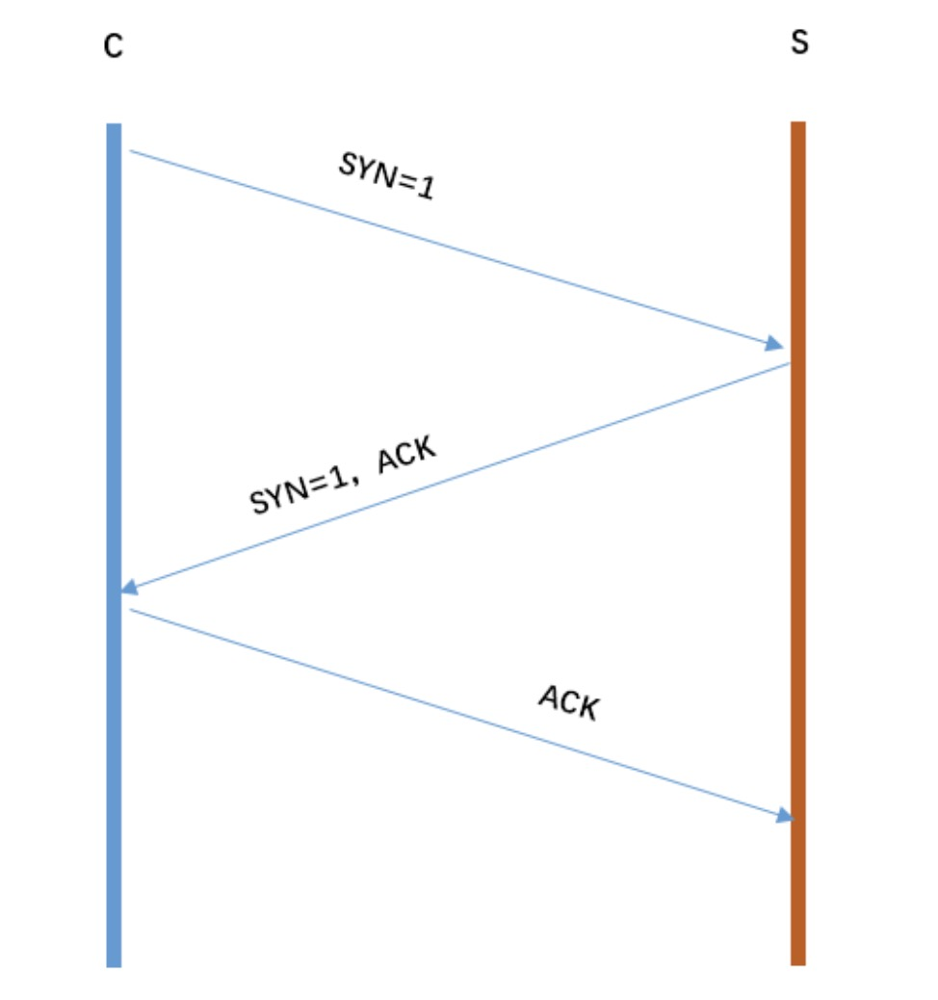

# HTTP和HTTPS

## 基本概念

***http:*** 超文本传输协议，是互联网上应用最为广泛的一种网络协议，是一个客户端和服务器端请求和应答的标准（TCP），用于从WWW服务器传输超文本到本地浏览器的传输协议，它可以使浏览器更加高效，使网络传输减少。

***https:*** 是以安全为目标的HTTP通道，简单讲是HTTP的安全版，即HTTP下加入SSL层，HTTPS的安全基础是SSL，因此加密的详细内容就需要SSL。

## 区别

http传输的数据都是未加密的，也就是明文的，网景公司设置了SSL协议来对http协议传输的数据进行加密处理，简单来说https协议是由http和ssl协议构建的可进行加密传输和身份认证的网络协议，比http协议的安全性更高。

主要的区别如下：

* Https协议需要ca证书，费用较高。
* http是超文本传输协议，信息是明文传输，https则是具有安全性的ssl加密传输协议。
* 使用不同的链接方式，端口也不同，一般而言，http协议的端口为80，https的端口为443。
* http的连接很简单，是无状态的；HTTPS协议是由SSL+HTTP协议构建的可进行加密传输、身份认证的网络协议，比http协议安全。

## TCP三次握手

客户端和服务端都需要直到各自可收发，因此需要三次握手。

每次握手的作用：

第一次握手：S只可以确认 自己可以接受C发送的报文段

第二次握手：C可以确认 S收到了自己发送的报文段，并且可以确认 自己可以接受S发送的报文段

第三次握手：S可以确认 C收到了自己发送的报文段

## TCP和UDP的区别
1) TCP是面向连接的，udp是无连接的即发送数据前不需要先建立链接。

2）TCP提供可靠的服务。也就是说，通过TCP连接传送的数据，无差错，不丢失，不重复，且按序到达;UDP尽最大努力交付，即不保证可靠交付。 并且因为tcp可靠，面向连接，不会丢失数据因此适合大数据量的交换。

3）TCP是面向字节流，UDP面向报文，并且网络出现拥塞不会使得发送速率降低（因此会出现丢包，对实时的应用比如IP电话和视频会议等）。

4）TCP只能是1对1的，UDP支持1对1,1对多。

5）TCP的首部较大为20字节，而UDP只有8字节。

6）TCP是面向连接的可靠性传输，而UDP是不可靠的。

## HTTP2.0

优势:

* 提升访问速度（可以对于，请求资源所需时间更少，访问速度更快，相比http1.0）

* 允许多路复用：多路复用允许同时通过单一的HTTP/2连接发送多重请求-响应信息。改善了：在http1.1中，浏览器客户端在同一时间，针对同一域名下的请求有一定数量限制（连接数量），超过限制会被阻塞

* 二进制分帧：HTTP2.0会将所有的传输信息分割为更小的信息或者帧，并对他们进行二进制编码

* 首部压缩

* 服务器端推送

