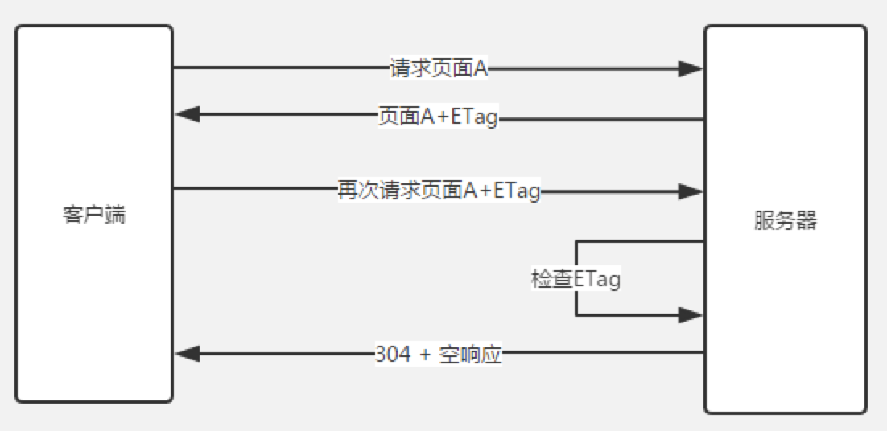
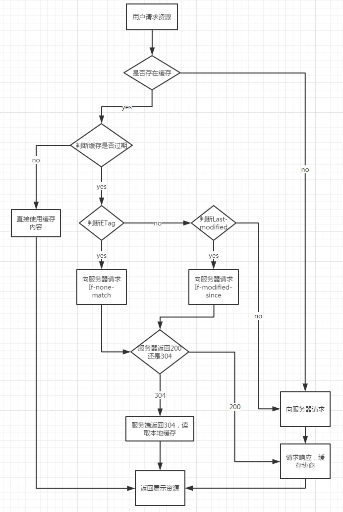

# 优化的方法
:::  tip
###  1. 资源压缩合并，减少HTTP请求：例如 Sprite图 
:::
:::  tip
###  2. 非核心代码异步加载
:::
* defer
defer是在HTML解析完之后才会执行，如果是多个，按照加载的顺序依次执行
* async
async是在加载完之后立即执行，如果是多个，执行顺序和加载顺序无关
:::  tip
### 3. 浏览器缓存
:::
### 参考: https://github.com/amandakelake/blog/issues/41

### 基本原理
1）浏览器在加载资源时，根据请求头的expires和cache-control判断是否命中强缓存，是则直接从缓存读取资源，不会发请求到服务器。 
2）如果没有命中强缓存，浏览器一定会发送一个请求到服务器，通过last-modified和etag验证资源是否命中协商缓存，如果命中，服务器会将这个请求返回，但是不会返回这个资源的数据，依然是从缓存中读取资源 
3）如果前面两者都没有命中，直接从服务器加载资源 

2、相同点 
如果命中，都是从客户端缓存中加载资源，而不是从服务器加载资源数据；

3、不同点 
强缓存不发请求到服务器，协商缓存会发请求到服务器。

### 强缓存: 

强缓存通过Expires和Cache-Control两种响应头实现

1、 Expires :

> Expires是http1.0提出的一个表示资源过期时间的header，它描述的是一个绝对时间，由服务器返回。
> Expires 受限于本地时间，如果修改了本地时间，可能会造成缓存失效

2、Cache-Control

> Cache-Control 出现于 HTTP / 1.1，优先级高于 Expires ,表示的是相对时间。 
> Cache-Control: max-age=315360000 
> Cache-Control: no-cache 存储到本地缓存区，在于原始服务器进行新鲜度再验证之前，缓存不能将其提供给客户端使用 
> Cache-Control: no-store 不缓存数据到本地 
> Cache-Control: public可以被所有用户缓存（多用户共享），包括终端和CDN等中间代理服务器 
> Cache-Control: private只能被终端浏览器缓存（而且是私有缓存），不允许中继缓存服务器进行缓存

### 协商缓存：

当浏览器对某个资源的请求没有命中强缓存，就会发一个请求到服务器，验证协商缓存是否命中，如果协商缓存命中，请求响应返回的http状态为304并且会显示一个Not Modified的字符串。 

协商缓存是利用的是【Last-Modified，If-Modified-Since】和【ETag、If-None-Match】这两对Header来管理的

1、Last-Modified，If-Modified-Since

Last-Modified 表示本地文件最后修改日期，浏览器会在request header加上If-Modified-Since（上次返回的Last-Modified的值），询问服务器在该日期后资源是否有更新，有更新的话就会将新的资源发送回来

但是如果在本地打开缓存文件，就会造成 Last-Modified 被修改，所以在 HTTP / 1.1 出现了 ETag

2、ETag、If-None-Match

Etag就像一个指纹，资源变化都会导致ETag变化，跟最后修改时间没有关系，ETag可以保证每一个资源是唯一的

If-None-Match的header会将上次返回的Etag发送给服务器，询问该资源的Etag是否有更新，有变动就会发送新的资源回来

ETag的优先级比Last-Modified更高

具体为什么要用ETag，主要出于下面几种情况考虑：

* 一些文件也许会周期性的更改，但是他的内容并不改变(仅仅改变的修改时间)，这个时候我们并不希望客户端认为这个文件被修改了，而重新GET； 
* 某些文件修改非常频繁，比如在秒以下的时间内进行修改，(比方说1s内修改了N次)，If-Modified-Since能检查到的粒度是s级的，这种修改无法判断(或者说UNIX记录MTIME只能精确到秒)； 
* 某些服务器不能精确的得到文件的最后修改时间。
### 整体流程图

:::  tip
### 4. 缓存协议头
::: 
* Expires
* Cache-Control 
* Last-Modified
* if-Modified-Since
* Etag
* If-None-Match

5. 使用CDN （属于网络优化，加速资源，让网络快速到达服务端下载）

