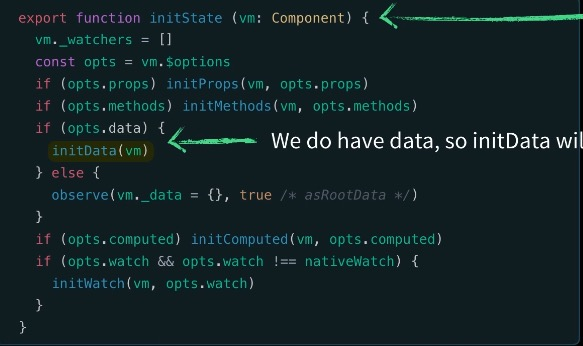
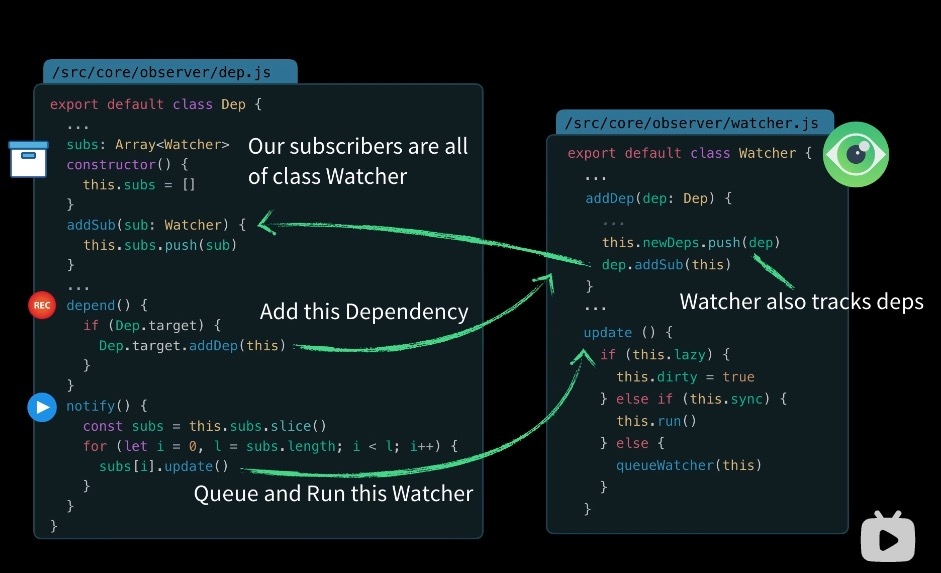

## 简单的例子
```js
<div id="app">
    <h1>{{ product }}</h1>
</div>
<script src="vue.js"></script>

var app = new Vue({
    el: '#app',
    data: {
        product: "Socks"
    }
})
``` 
 在Vue中如何将上述代码里data中的product变成响应式的呢？ 我们可以在vue的源码中找到如下部分
 <br>
 如图所示当我们new一个Vue的实例时，它将调用initMinxin方法,并在其中执行_init方法来初始化生命周期（lifecycle）、事件（events）、渲染（render）。<br>
 在Vue官方文档中[生命周期的图示](https://cn.vuejs.org/v2/guide/instance.html#%E7%94%9F%E5%91%BD%E5%91%A8%E6%9C%9F%E5%9B%BE%E7%A4%BA)与代码对应的关系如下图
 <br>
 在此处我们只来研究数据的响应式所以我们要关注的是**initState**方法
 <br>
 如上图当data存在的时候我们调用**initData**方法
 <br>
  ```js
  export class Observer {
      value: any;
      constructor (value: any) {
          this.value = value
          //...
          if(Array.isArray(value)) {
              //...
              this.observeArry(value)
          }else{
              this.walk(value)
          }
      }
      observeArray (items: Array<any>) {
          for(let i = 0, l = items.length; i < l; i++) {
              observe(items[i])
          }
      }
      walk (obj: Object) {
          const keys =  Object.keys(obj)

          for(let i = 0; i < keys.length; i++) {
              defineReactive(obj, keys[i], obj[keys[i]])
          }
      }
  }
  ```
 <br>
  创建一个响应式数据代码的调用栈如下图所示：
 <br>
 
 ::: warning
   在Vue2响应式系统中需要注意的事项。
 :::

 ### 1.数组方法的变异
 在Vue中已经对push(),pop(),shift(),unshift(),splice(),sort(),reverse()等数组的方法进行了重新以保证调用时能触发更新。
 ### 2.响应式数据的设置
 在设置数组和对象为响应式时，使用常规的xxx['xxx'] = newValue 这种类似的方法无法将新添加的数据变成响应式，需要使用Vue提供的方法Vue.set()来设置以保证属性的响应性。<br> 
 对于对象的多个属性 可以使用 obj = Object.assign({},obj,{xx:'xxx'})来设置。


