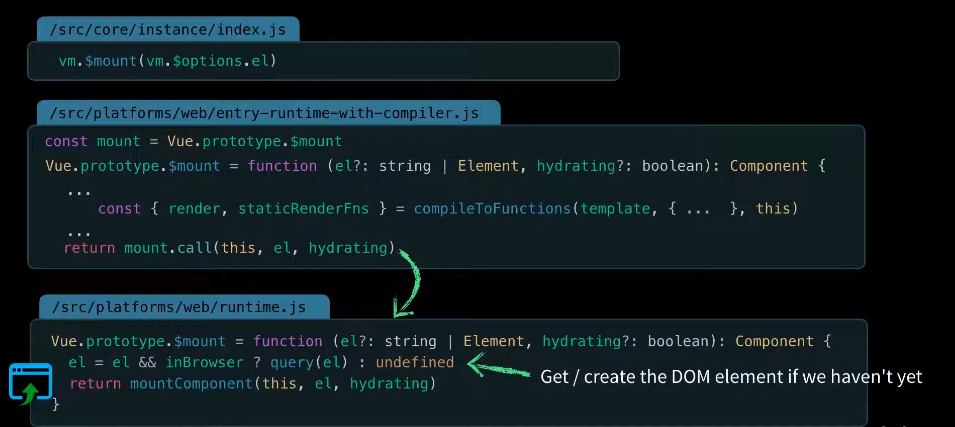
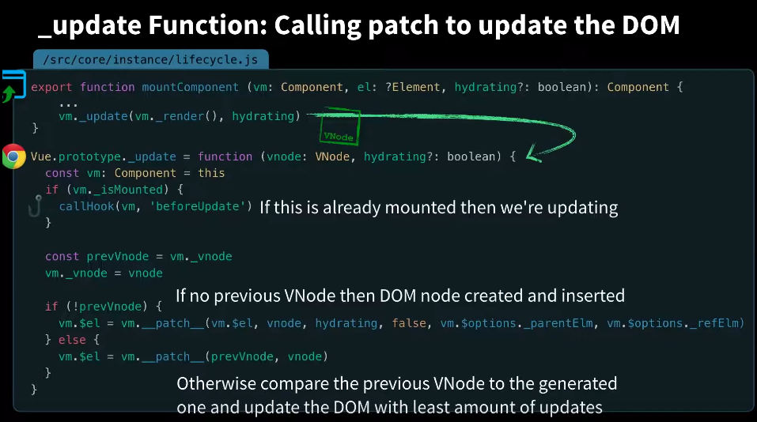
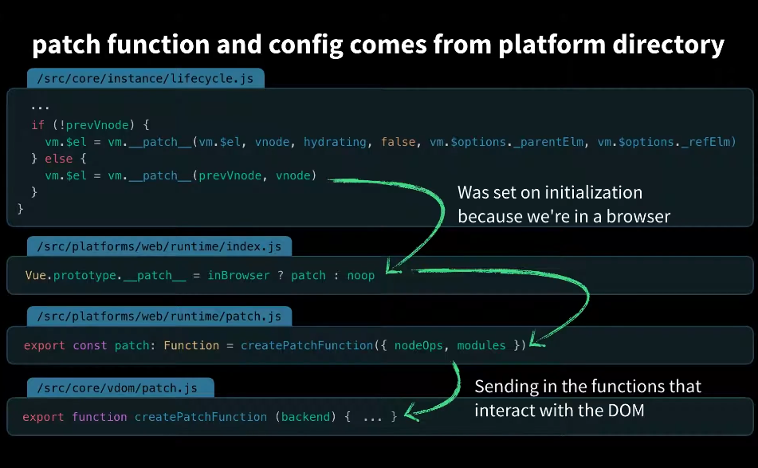

## 组件挂载和更新的机制
```js
export function mountComponent (...) {
    //...
    callHook(vm, 'beforeMount)

    let updateComponent = () => {
        vm._update(vm._render(), hydrating)
    }
}
new Watcher(vm, updateComponent, noop, null, true)
```
如上述代码,mountedComponent这个函数在哪执行?在有template的情况下又如何执行呢？<br>

当vm.$opptions.el存在时将会调用vm.$mount方法。执行过程如下图:<br>

如上图所示此时会进行判断是否存在渲染函数，判断是否存在template将会调用complieToFunctions编译成渲染函数再执行。
我们的目标mountedComponent就在$mounted中如下图:

而在mountedComponent函数则先执行vm._render执行返回Virtual Node再调用vm._update。





