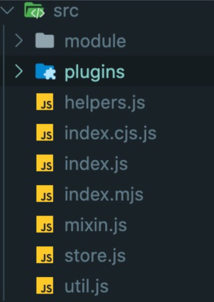

Vuex是学习Vue过程中一个必不可少的环节，它采用集中式存储管理应用的所有组件的状态。主要用来处理**多个组件共享状态**单向数据流的简洁性容易被破坏的问题。使用方式就不在这里赘述，详细解释可以看[vuex官网](https://vuex.vuejs.org/zh/)。

虽然在项目开发中经常使用到Vuex，但是对其原理和一些概念还是模糊。决定深入学习一下。

首先罗列一下目前存在的不理解问题:

1. 使用Vuex只需要执行Vue.use(Vuex),在Vue配置中传入一个store对象，store对象是如何注入使得每个组件都能访问到？ 
2.  在执行dispatch触发action（commit同理）的时候，只需传入（type, payload），action执行函数中第一个参数store从哪里获取的？
3. 如何区分state是外部直接修改，还是通过mutation方法修改的两种方式修改有什么不同会导致什么问题？
4. mutation和action的区别？如在再mutation里写异步会导致什么后果？

# 源码分析

## 核心流程图


## 源码目录结构

打开Vuex项目，目录如下



各个目录文件的功能： 

* module：提供module对象与module对象树的创建功能；

* plugins：提供开发辅助插件，如“时光穿梭”功能，state修改的日志记录功能等；

* helpers.js：提供action、mutations以及getters的查找API； 

* index.js：是源码主入口文件，提供store的各module构建安装； 

* mixin.js：提供了store在Vue实例上的装载注入；

* util.js：提供了工具方法如find、deepCopy、forEachValue以及assert等方法。

了解了目录结构接下来我我们围绕问题来一点一点解析解析源码。

## 问题一
例子：
```js
/**
*   store.js 文件
*   创建store,配置state、action、mutation 以及getter
**/

import Vue from 'vue'
import Vuex from 'vuex'

// istall vuex框架

Vue.use(Vuex)

//创建并导出stroe对象.

export default new Vuex.Store({
    state: {},
    mutations: {}
    //...
})
```
```js
/**
 *  vue-index.js文件
 **/

 import Vue from  'vue'
 import App from './../pages/app.vue'
 import store from './store.js'
 new Vue({
  el: '#app',
  router,
  store, 
  render: h => h(App)
})
```
打开源码我们可以发现当调用Vue.use(Vuex)时，它会调用 **applyMinxin(Vue)** 这个函数。这个函数是mixin.js文件中导出的。里面就是问题一的答案，代码如下。
```js
export default function (Vue) {
  const version = Number(Vue.version.split('.')[0])
  // 此处根据Vue版本来选择不同的实现方法来兼容执行vuexInit方法
  if (version >= 2) {
    Vue.mixin({ beforeCreate: vuexInit })
  } else {
    // override init and inject vuex init procedure
    // for 1.x backwards compatibility.
    // Vue的_init 方法会在vue初始化的时候执行。这里重新写了修改合并了一下Option
    const _init = Vue.prototype._init
    Vue.prototype._init = function (options = {}) {
      options.init = options.init
        ? [vuexInit].concat(options.init)
        : vuexInit
      _init.call(this, options)
    }
  }

  /**
   * Vuex init hook, injected into each instances init hooks list.
   */

  function vuexInit () {
    //在初始化的时候 会在根实例上的$store属性上注入
    // 子组件从其父组件引用$store属性，层层嵌套进行设置。
    // 在任意组件中执行 this.$store 都能找到装载的那个store对象
    const options = this.$options
    // store injection
    if (options.store) {
      this.$store = typeof options.store === 'function'
        ? options.store()
        : options.store
    } else if (options.parent && options.parent.$store) {
      this.$store = options.parent.$store
    }
  }
}

```
## 问题二
**registerMutation** 方法中，获取store中的对应mutation type的处理函数集合，将新的处理函数push进去。这里将我们设置在mutations type上对应的 handler 进行了封装，给原函数传入了state。在执行 commit('xxx', payload) 的时候，type为 xxx 的mutation的所有handler都会接收到state以及payload，这就是在handler里面拿到state的原因。

同理 **registerAction**  方法中也对store中对应的actions type的处理函数集合进行了处理。

```js
// mutation 的处理函数
function registerMutation (store, type, handler, local) {
      // 取出对应type的mutations-handler集合
  const entry = store._mutations[type] || (store._mutations[type] = [])
  entry.push(function wrappedMutationHandler (payload) {
      // 调用handler并将state传入
    handler.call(store, local.state, payload)
  })
}

// action 的处理函数
function registerAction (store, type, handler, local) {
      // 取出对应type的actions-handler集合
  const entry = store._actions[type] || (store._actions[type] = [])
    // 存储新的封装过的action-handler
  entry.push(function wrappedActionHandler (payload) {
    let res = handler.call(store, {
      dispatch: local.dispatch,
      commit: local.commit,
      getters: local.getters,
      state: local.state,
      rootGetters: store.getters,
      rootState: store.state
    }, payload)

    // action需要支持promise进行链式调用，这里进行兼容处理
    if (!isPromise(res)) {
      res = Promise.resolve(res)
    }
    if (store._devtoolHook) {
      return res.catch(err => {
        store._devtoolHook.emit('vuex:error', err)
        throw err
      })
    } else {
      return res
    }
  })
}

```

## 问题三

Vuex中修改state的唯一方法就是commit('xx', payload),其底层通过执行this._withCommit(fn)设置_committing标志变量为true，然后才执行修改state的方法。修改完之后要还原之前的设置。 外部虽然可以直接修改state，但是并没有修改_committing标志位。

虽然我们可以通过直接赋值来修改state,但是**强烈**不建议这样使用


使用如 vuex 本身就是希望基于这样一个数据结构的约定，使得项目代码更加直观和简单。每一个 state
树对应整个项目的一个数据，每一个 mutation 执行完成后都可以更新到一个新的状态。这样 devtools 就可以打个 snapshot 存下来。可以尝试开着 devtool 调用一个异步的 action，可以清楚地看到它所调用的 mutation 是何时被记录下来的，并且可以立刻查看 mutation 对应的状态。

所以，通过commit 提交 mutation 的方式来修改 state 时，vue的调试工具能够记录每一次 state 的变化，这样方便调试。但是如果是直接修改state，则没有这个记录，那样做会使状态不受我们管控。如果是多个模块需要引用一个state的，然后每个人可能由不同的人开发，如果直接修改值，可能会造成数据的混乱，Mutation 也记录不到，到时候调试会有麻烦。但是通过 mutation 修改 state 这样设计，就有个统一的地方进行逻辑运算去修改。如果逻辑有变动，修改一个地方就可以了。

```js

this._committing = false // 此处默认设置为false 是否在进行提交状态标识
this._actions = Object.create(null) // acitons操作对象
this._mutations = Object.create(null) // mutations操作对象
this._wrappedGetters = Object.create(null) // 封装后的getters集合对象
this._modules = new ModuleCollection(options) // Vuex支持store分模块传入，存储分析后的modules
this._modulesNamespaceMap = Object.create(null) // 模块命名空间map
this._subscribers = [] // 订阅函数集合，Vuex提供了subscribe功能
this._watcherVM = new Vue() // Vue组件用于watch监视变化


  _withCommit (fn) {
    const committing = this._committing
    this._committing = true
    fn()
    this._committing = committing
  }
```

## 问题四


## end
以上总结来部分来自于美团技术团队分享和自己的总结[美团技术团队](https://tech.meituan.com/2017/04/27/vuex-code-analysis.html)。


